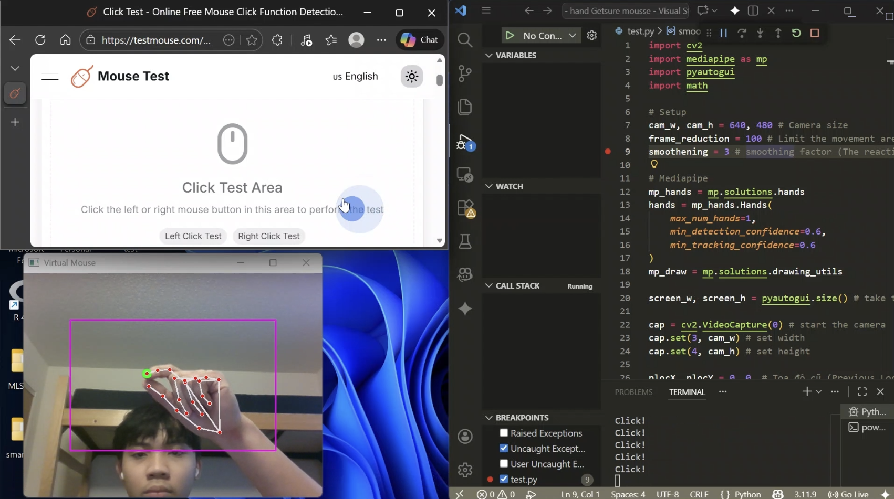

# Virtual Hand Mouse

Control your computer mouse using hand gestures through a webcam.  
Uses OpenCV, MediaPipe, and PyAutoGUI to track your index finger and convert movement into mouse control, with thumb+index pinch for clicking.

---
## 📸 Test Images

## ✨ Features

- Real-time hand tracking with **MediaPipe Hands**
- Move cursor with **index fingertip**
- **Left click** by pinching **thumb + index finger**
- Purple rectangle = **control region** (no need to reach camera edges)
- Smoothing to reduce cursor shaking

---

## 🧰 Tech Stack

- **Python**
- **OpenCV** – webcam capture & drawing
- **MediaPipe Hands** – 21 hand landmarks tracking
- **PyAutoGUI** – system mouse control
- **math** – distance calculation for gestures

---

## 📦 Installation

1. **Clone repo:**
```bash
git clone https://github.com/phongilm20/Virtual-Hand-Mouse.git
cd Virtual-Hand-Mouse
```

2. **Virtual env (optional):**
```bash
python -m venv venv
# Windows:
venv\Scripts\activate
# Linux/macOS:
source venv/bin/activate
```

3. **Install deps:**
```bash
pip install opencv-python mediapipe pyautogui
```

---

## 🚀 Run

```bash
python virtual_mouse.py
```

---

## 🎮 Usage

1. Connect webcam (must be free).
2. Run script → **"Virtual Mouse"** window opens.
3. See **purple rectangle** = active area.
4. Move **index finger** inside → cursor moves full screen.
5. **Pinch thumb + index** → left click.
6. Press **q** to quit.

---


## ⚙️ How It Works

```
MediaPipe → 21 landmarks/hand
Landmark 8 (index tip) → mouse position
Landmark 4 (thumb tip) → pinch detection w/ landmark 8
Coords: purple rect  → full screen [0,screen_w][1]
Smoothing applied
```

---

## 🧪 Future Features

- Right-click gesture
- Double-click
- Scroll gesture
- FPS counter
- Config UI

---

## 👤 Author

[@phongilm20](https://github.com/phongilm20)

---

## ⚠️ Warning

PyAutoGUI controls REAL mouse. Test carefully!
